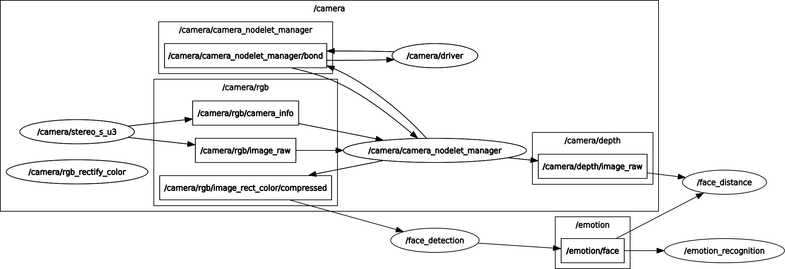

# Face Recognition Ultra Light

The light-weight ROS face recognition package based on Python3.

## Installation

* Install ROS melodic
* Install python packages, you might need to upgrade your pip version at first
    * `pip3 install -r requirements.txt`


## Emotion Detection over mqtt
* In order to run the camra node you must have ros_astera_camera installed in your ros workspace: https://github.com/orbbec/ros_astra_camera
* run `roslaunch face_recognition_ultra_light face_recognition_ultra_light.launch`
* From any computer run `python3 mqtt_emotion_subscriber.py` located in `face_recognition_ultra_light/scripts`

## Face Training

* To add training data, you can use `faces/recorder.py`
    ```bash
    cd faces
    python3 recorder.py
    ```
    To quit the program, press **q**
* After having a video for training, you should move it to `faces/training/<name>/<name>.avi`
* Then run `python3 training.py` to create your model
* Finally you can run the launch file
  ```bash
  roslaunch face_recognition_ultra_light face_recognition_ultra_light.launch
  ```
  
## RQt Graph


## Result


## Reference
* https://towardsdatascience.com/real-time-face-recognition-with-cpu-983d35cc3ec5
* https://mc.ai/emotion-recognition-using-keras/
* Chen, Sheng, et al. "Mobilefacenets: Efficient cnns for accurate real-time face verification on mobile devices." Chinese Conference on Biometric Recognition. Springer, Cham, 2018.
* Simonyan, Karen, and Andrew Zisserman. "Very deep convolutional networks for large-scale image recognition." arXiv preprint arXiv:1409.1556 (2014).
